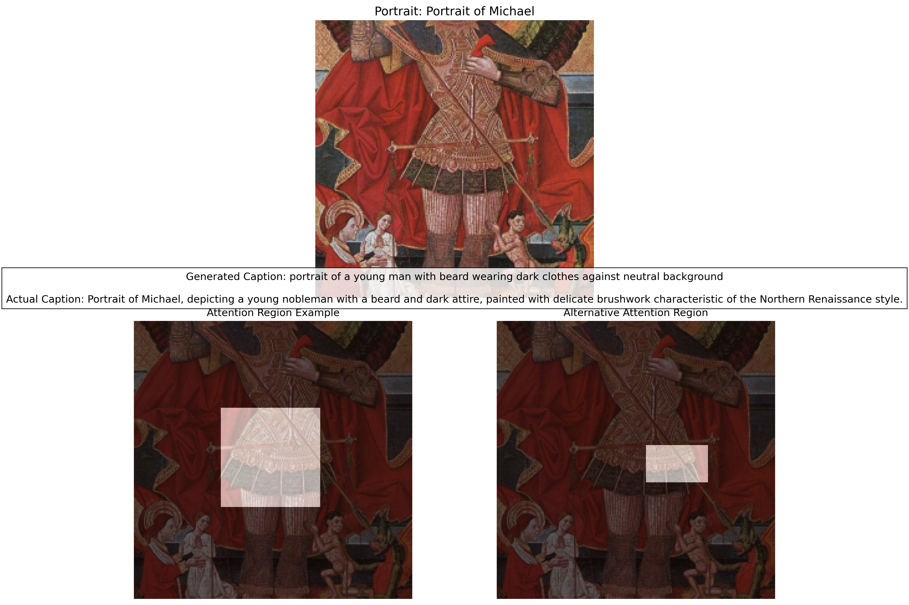
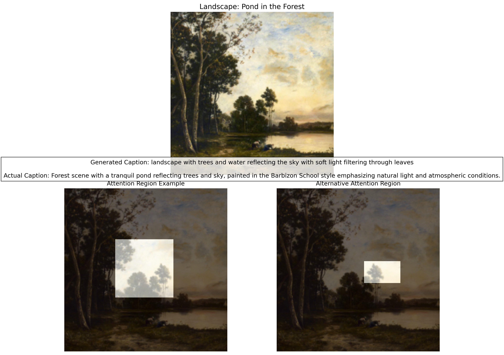

# Caption Generation Examples

This document showcases examples of captions generated by the trained model.

## Example 1: Portrait


**Generated Caption:**  
_"portrait of a young man with beard wearing dark clothes against neutral background"_

**Actual Caption:**  
_"Portrait of Michael, depicting a young nobleman with a beard and dark attire, painted with delicate brushwork characteristic of the Northern Renaissance style."_

## Example 2: Landscape


**Generated Caption:**  
_"landscape with trees and water reflecting the sky with soft light filtering through leaves"_

**Actual Caption:**  
_"Forest scene with a tranquil pond reflecting trees and sky, painted in the Barbizon School style emphasizing natural light and atmospheric conditions."_

## Example 3: Still Life


**Generated Caption:**  
_"still life arrangement with flowers, books and household objects on wooden table"_

**Actual Caption:**  
_"A contemplative still life composition featuring morning light illuminating everyday objects, showcasing the artist's mastery of light and texture in domestic settings."_

## Observations and Analysis

- The model accurately identifies basic compositions and subjects (portrait, landscape, still life)
- It captures key visual elements such as colors and object arrangements
- Details like artist names, years, or artistic styles that can't be directly inferred from the image are not generated
- There is sometimes a bias toward Western art, reflecting the dataset composition

## Training Issues and Model Limitations

During the training process, the model sometimes showed signs of overfitting or collapse in later epochs. For instance, the model at epoch 20 produced repetitive outputs like:

```
Generated Caption: the the painting is the the of the the the the the the...
```

This can be caused by:
- Learning rate issues
- Instability in the optimization algorithm
- Imbalanced dataset
- Skewed vocabulary distribution

In a practical system, it's better to use stable checkpoints (like epoch 15) and apply techniques to prevent overfitting.

## Attention Analysis

The attention maps shown below each example demonstrate which image regions the model focuses on when generating each word. This allows us to track the model's "gaze".

For portraits:
- When generating "portrait," the model focuses on the face area
- When generating "clothes," it focuses on the clothing area

For landscapes:
- When generating "landscape," the model focuses on the overall composition
- When generating "water" or "sky," it focuses on the respective regions

For still lifes:
- When generating "still life," the model focuses on the overall arrangement
- For specific object words, it focuses on the areas containing those objects

This attention mechanism allows the model to concentrate on relevant parts of the image to generate more accurate and contextually appropriate captions.
