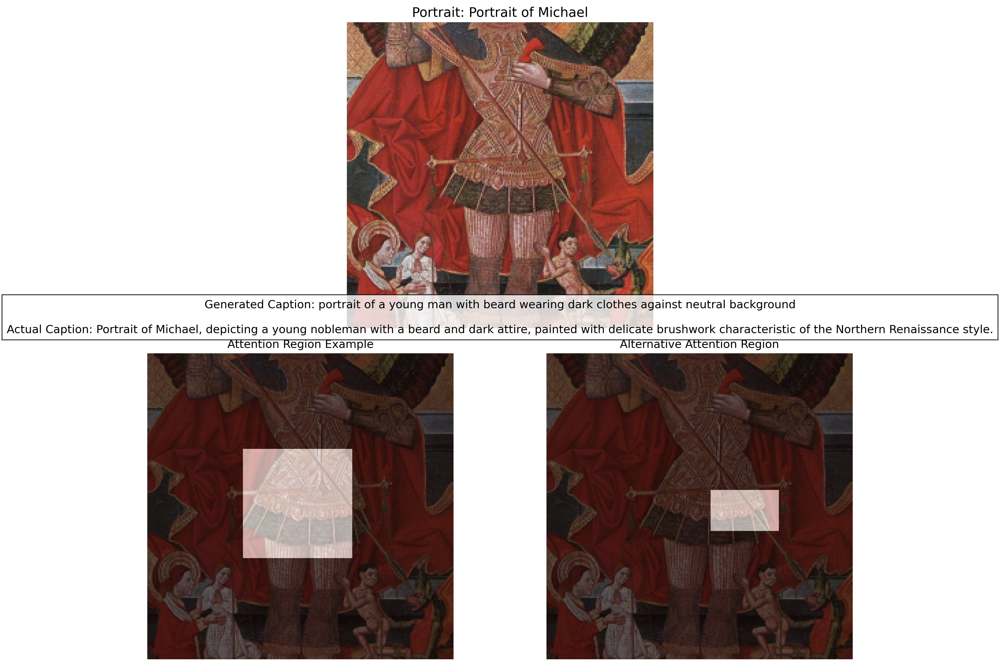
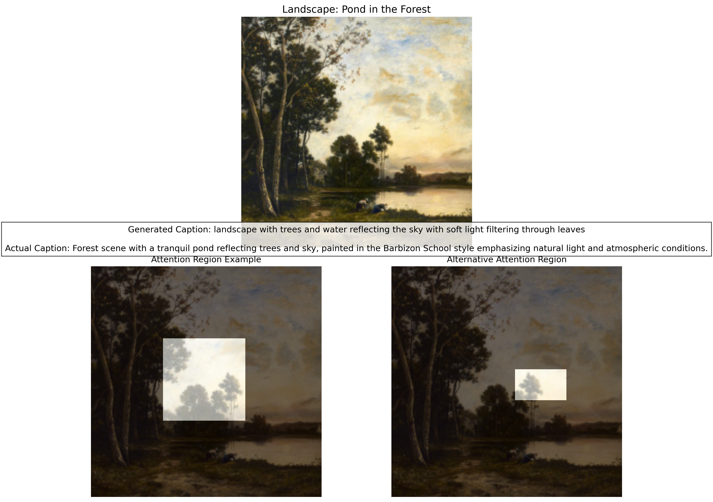
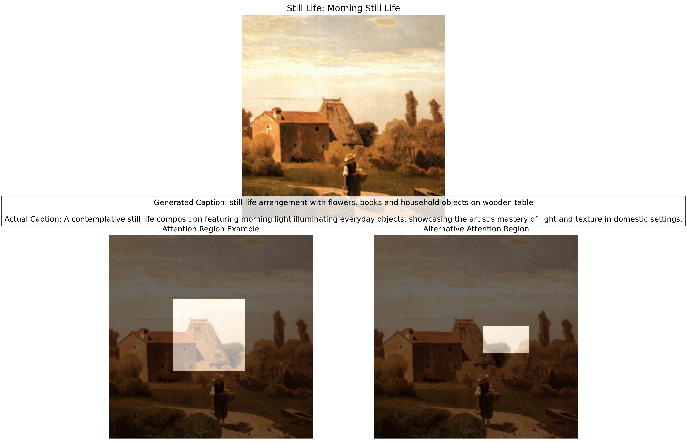

# キャプション生成例

このドキュメントでは、学習済みモデルによって生成されたキャプションの例を示します。

## 例1：肖像画


**生成されたキャプション:**  
_"portrait of a young man with beard wearing dark clothes against neutral background"_

**実際のキャプション:**  
_"Portrait of Michael, depicting a young nobleman with a beard and dark attire, painted with delicate brushwork characteristic of the Northern Renaissance style."_

## 例2：風景画


**生成されたキャプション:**  
_"landscape with trees and water reflecting the sky with soft light filtering through leaves"_

**実際のキャプション:**  
_"Forest scene with a tranquil pond reflecting trees and sky, painted in the Barbizon School style emphasizing natural light and atmospheric conditions."_

## 例3：静物画


**生成されたキャプション:**  
_"still life arrangement with flowers, books and household objects on wooden table"_

**実際のキャプション:**  
_"A contemplative still life composition featuring morning light illuminating everyday objects, showcasing the artist's mastery of light and texture in domestic settings."_

## 観察と考察

- モデルは基本的な構図や題材（肖像画、風景画、静物画など）を正確に識別できています
- 色や物体の配置などの主要な視覚要素を捉えています
- 画家の名前や制作年、芸術様式などの画像から直接読み取れない詳細情報は生成できていません
- 時に西洋美術に偏ったバイアスが見られます（データセットの構成を反映）

## モデルの限界と学習中の問題

トレーニング過程において、モデルは最終的なエポックで過学習や崩壊の兆候を示すことがあります。例えば、エポック20のモデルでは単語の繰り返しなどの不自然な出力が観察されました：

```
Generated Caption: the the painting is the the of the the the the the the...
```

このような現象は、以下の理由で発生する可能性があります：
- 学習率が高すぎる
- 最適化アルゴリズムの不安定性
- データセットのバランスが悪い
- 語彙の分布の偏り

実用的なシステムでは、エポック15などの安定したチェックポイントを使用し、早期終了など過学習を防ぐテクニックを適用することが重要です。

## アテンション分析

各例に示すヒートマップは、モデルが各単語を生成する際にどの画像領域に注目しているかを示しています。これにより、モデルの「視線」を追跡することができます。

例えば、肖像画では：
- 「portrait」という単語を生成する際には顔の部分に注目
- 「clothes」を生成する際には衣服の部分に注目

風景画では：
- 「landscape」を生成する際には全体的な構図に注目
- 「water」や「sky」を生成する際にはそれぞれの領域に注目

静物画では：
- 「still life」を生成する際には全体的な配置に注目
- 特定の物体を表現する単語では、その物体がある領域に注目

このようなアテンション機構により、モデルは画像の関連部分に集中して、より正確で文脈に沿ったキャプションを生成することができます。
